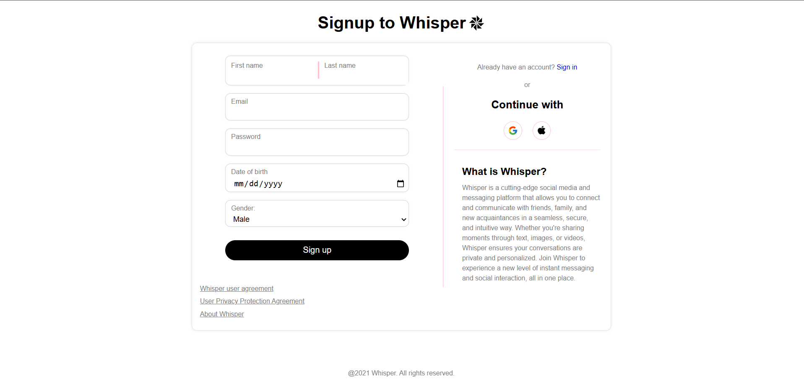

# Messaging Web Application

This is a chat web application written in Django. It allows users to send and receive messages in real-time.


## Setup

1. **Clone the repository:**

    ```bash
    git clone https://github.com/Suyog-Rijal/Messaging-webApplication-DJANGO.git
    ```

2. **Create a virtual environment:**

    ```bash
    python -m venv venv
    ```

3. **Activate the virtual environment:**

    - On Windows:

      ```bash
      venv\Scripts\activate
      ```

    - On macOS/Linux:

      ```bash
      source venv/bin/activate
      ```

4. **Install the dependencies:**

    ```bash
    pip install -r requirements.txt
    ```

5. **Run the migrations:**

    ```bash
    python manage.py makemigrations
    python manage.py migrate
    ```

6. **Create a superuser (for accessing the Django admin):**

    ```bash
    python manage.py createsuperuser
    ```

    Follow the prompts to create your superuser account.
7. **Configure `settings.py`:**

    - Open `Whisper/settings.py`
    - Setup email configuration at the bottom of the file:
    - Replace the following with your own email and an app-specific password:

      ```python
      EMAIL_BACKEND = 'django.core.mail.backends.smtp.EmailBackend'
      EMAIL_HOST = 'smtp.gmail.com'
      EMAIL_PORT = 587
      EMAIL_USE_TLS = True
      EMAIL_HOST_USER = 'your-email@gmail.com'  # Enter your email here
      EMAIL_HOST_PASSWORD = 'your-app-password' # Enter the app password here
      ```

    - **Important:** Do not enter your real email password. Instead, follow these steps to generate an app password:
      1. Go to [Google App Passwords](https://myaccount.google.com/apppasswords)
      2. Create a new app and generate a password
      3. Use the generated password in the `EMAIL_HOST_PASSWORD` field

    - For detailed instructions, you can also watch this [YouTube tutorial](https://youtu.be/IWxwWFTlTUQ).


8. **Run the development server:**

    ```bash
    python manage.py runserver
    ```

    The application will be available at `http://127.0.0.1:8000/`.

## Demo images

<table>
  <tr>
    <td></td>
    <td></td>
  </tr>
  <tr>
    <td></td>
    <td></td>
  </tr>
</table>

